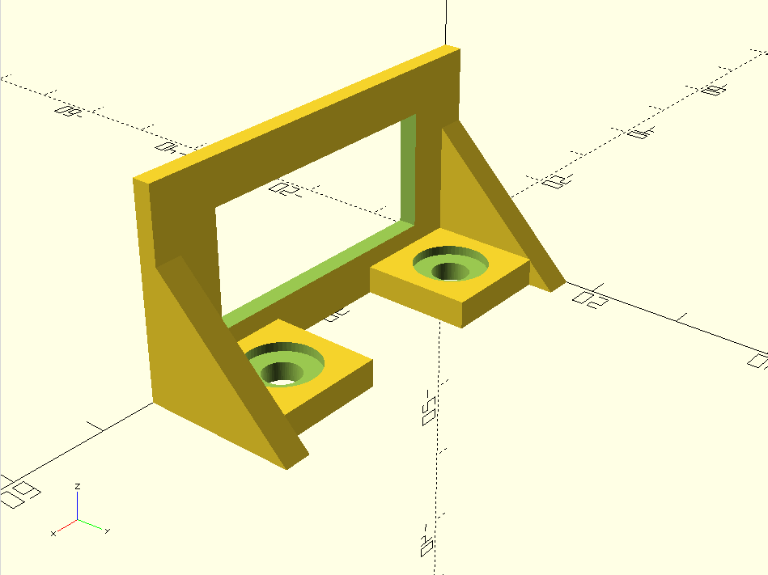

# 3D printed rocker switch mount

This is a 3D printed mount for a rocker switch made by
[Oslo Switch](https://www.osloswitch.com/). I *think* it should
work with standard panel-mount rocker switches designed for
a nominal 29mm by 14mm cutout.

It is designed to be screwed down to a horizontal surface
using 6-32 machine screws.

I sliced it using Cura and printed using PLA on an Ender 3
with 40% infill.

The STL file is included, but I don't guarantee that it's up to
date. I recommend loading the source in OpenSCAD and regenerating
the STL.

## Images

Installed on an open-frame PC "case":

Preview in OpenSCAD:

## License

This design is public domain. Feel free to use it as you see fit.

This work is marked with <a href="http://creativecommons.org/publicdomain/zero/1.0?ref=chooser-v1" target="_blank" rel="license noopener noreferrer" style="display:inline-block;">CC0 1.0</a>
 
